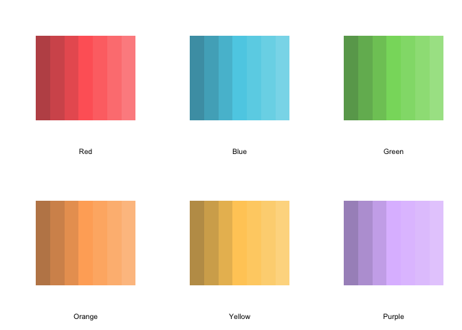

<!-- README.md is generated from README.Rmd. Please edit that file -->

# ayu

<!-- badges: start -->
<!-- badges: end -->

The goal of `ayu` is to provide a suite of tools to standardise the look
of visualisations. By using the beautiful palette of
[ayu](https://github.com/ayu-theme/ayu-colors) colours.

## Installation

You can install the development version of ayu from
[GitHub](https://github.com/aljrico/ayu) with:

``` r
# install.packages("devtools")
devtools::install_github("aljrico/ayu")
#> Skipping install of 'ayu' from a github remote, the SHA1 (281377fe) has not changed since last install.
#>   Use `force = TRUE` to force installation
library(ayu)
```

## How to use

##### Main Colours

The most basic functionality `ayu` provides is the curated list of main
colours. Simply retrieve them with:

``` r
get_main_colours()
#> $mirage
#> $mirage$red
#> [1] "#ff6666"
#> 
#> $mirage$yellow
#> [1] "#ffcc66"
#> 
#> $mirage$blue
#> [1] "#5CCFE6"
#> 
#> $mirage$green
#> [1] "#87D96C"
#> 
#> $mirage$orange
#> [1] "#FFAD66"
#> 
#> $mirage$purple
#> [1] "#DFBFFF"
```

##### Display Palette

A quick way to visualise and print the colours is to make use of the
`display_palette()` function. This will simply print the list of colours
it gets passed.

``` r
colours <- get_main_colours()
display_palette(
  c(
    colours$mirage$red,
    colours$mirage$yellow,
    colours$mirage$green,
    colours$mirage$blue
  ),
  xlab = 'Main Colours'
)
```


##### Continuous Palettes

``` r
par(mfrow=c(2,3))
generate_continuous_palette(palettes$mirage$red) |> display_palette(xlab = 'Red')
generate_continuous_palette(palettes$mirage$blue) |> display_palette(xlab = 'Blue')
generate_continuous_palette(palettes$mirage$green) |> display_palette(xlab = 'Green')
generate_continuous_palette(palettes$mirage$orange) |> display_palette(xlab = 'Orange')
generate_continuous_palette(palettes$mirage$yellow) |> display_palette(xlab = 'Yellow')
generate_continuous_palette(palettes$mirage$purple) |> display_palette(xlab = 'Purple')
```



You’ll still need to render `README.Rmd` regularly, to keep `README.md`
up-to-date. `devtools::build_readme()` is handy for this. You could also
use GitHub Actions to re-render `README.Rmd` every time you push. An
example workflow can be found here:
<https://github.com/r-lib/actions/tree/v1/examples>.

You can also embed plots, for example:


In that case, don’t forget to commit and push the resulting figure
files, so they display on GitHub and CRAN.
