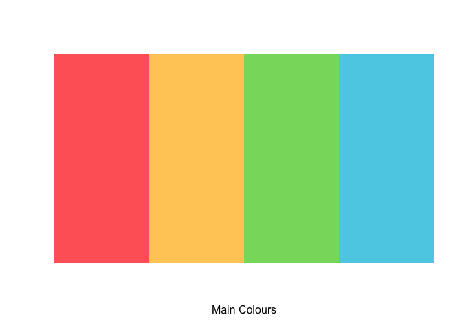
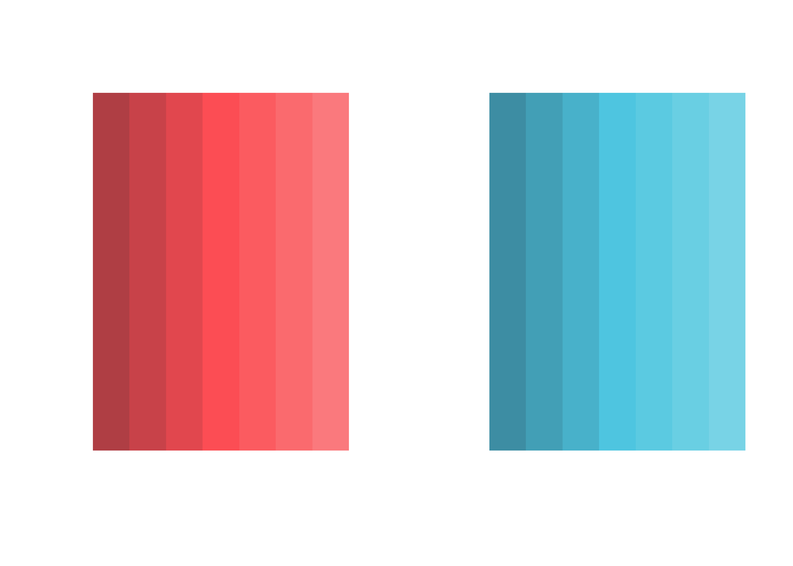
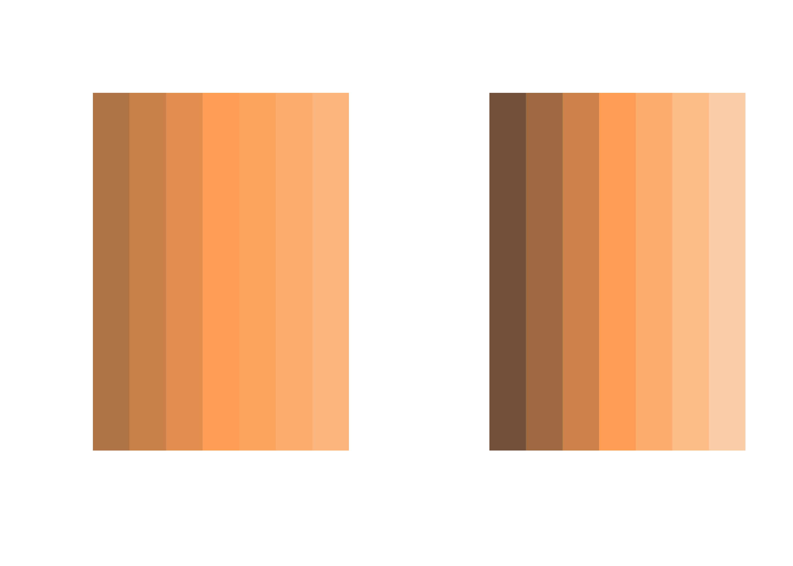
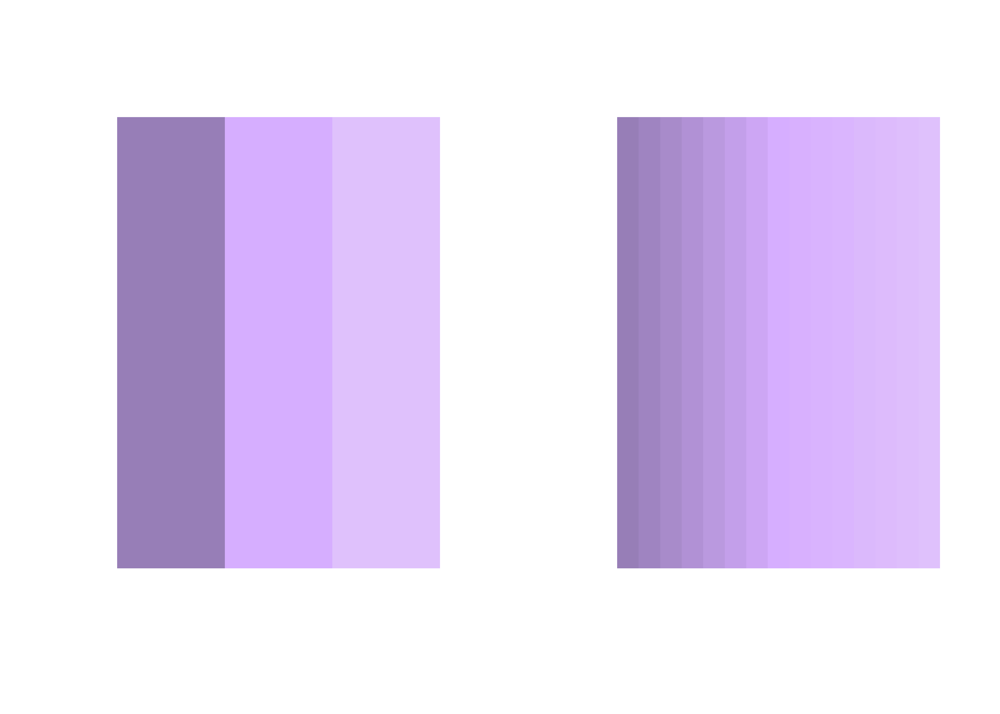
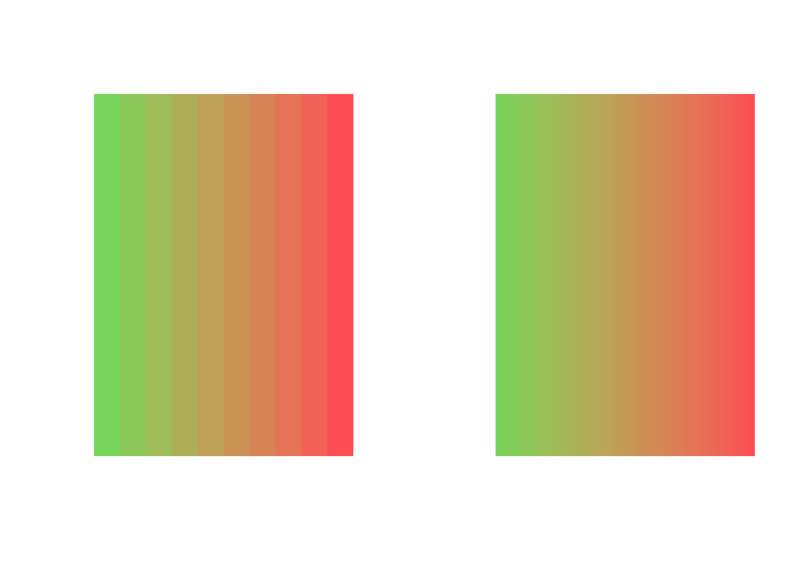
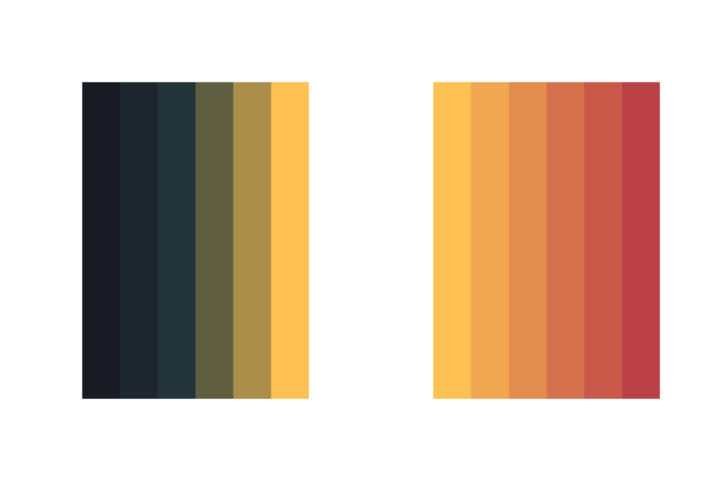

<!-- README.md is generated from README.Rmd. Please edit that file -->

# ayu

<!-- badges: start -->
<!-- badges: end -->

The goal of `ayu` is to provide a suite of tools to standardise the look
of visualisations. By using the beautiful palette of
[ayu](https://github.com/ayu-theme/ayu-colors) colours.

## Installation

You can install the development version of ayu from
[GitHub](https://github.com/aljrico/ayu) with:

``` r
# install.packages("devtools")
devtools::install_github("aljrico/ayu")
library(ayu)
```

    #> ℹ Loading ayu

## How to use

##### Main Colours

The most basic functionality `ayu` provides is the curated list of main
colours. Simply retrieve them with:

``` r
get_main_colours()
#> $mirage
#> $mirage$red
#> [1] "#ff6666"
#> 
#> $mirage$yellow
#> [1] "#ffcc66"
#> 
#> $mirage$blue
#> [1] "#5CCFE6"
#> 
#> $mirage$green
#> [1] "#87D96C"
#> 
#> $mirage$orange
#> [1] "#FFAD66"
#> 
#> $mirage$purple
#> [1] "#DFBFFF"
#> 
#> $mirage$darkblue
#> [1] "#409fff"
#> 
#> 
#> $synthetic
#> $synthetic$bluesea
#> [1] "#67BFAD"
#> 
#> $synthetic$darkbluesea
#> [1] "#25333D"
```

##### Display Palette

A quick way to visualise and print the colours is to make use of the
`display_palette()` function. This will simply print the list of colours
it gets passed.

``` r
colours <- get_main_colours()
display_palette(
  c(
    colours$mirage$red,
    colours$mirage$yellow,
    colours$mirage$green,
    colours$mirage$blue
  ),
  xlab = 'Main Colours'
)
```



##### Sequential Palettes

A common approach to create palettes is to pick a main *hue* and modify
the *saturation* and *value*. `ayu` provides a quick function to
facilitate that while maintaining a cohesive feel.

``` r
par(mfrow=c(1,2))
generate_sequential_palette(colours$mirage$red) |> display_palette()
generate_sequential_palette(colours$mirage$blue) |> display_palette()
```



The `generate_sequential_palette()` function also provides a `contrast`
parameter to tweak the steepness of the gradient.

``` r
par(mfrow=c(1,2))
generate_sequential_palette(colours$mirage$orange, contrast = 0.3) |> display_palette()
generate_sequential_palette(colours$mirage$orange, contrast = 0.6) |> display_palette()
```



And the `n` parameter to select the number of colours generated

``` r
par(mfrow=c(1,2))
generate_sequential_palette(colours$mirage$purple, n = 3) |> display_palette()
generate_sequential_palette(colours$mirage$purple, n = 15) |> display_palette()
```



##### Expand Palette

To facilitate custom design of divergent palettes, the `ayu` package
provides the `expand_palette()` function, that will take an arbitrary
number of colours and create a continuum between them

``` r
par(mfrow=c(1,2))
expand_palette(c(colours$mirage$green, colours$mirage$red), n = 10) |> display_palette()
expand_palette(c(colours$mirage$green, colours$mirage$red), n = 100) |> display_palette()
```



##### Diverging Palettes

The package also contains a few predefined diverging palettes. Those are
available as stand-alone functions.

``` r
diverging_palette('darkBlueYellow') |> display_palette()
```


